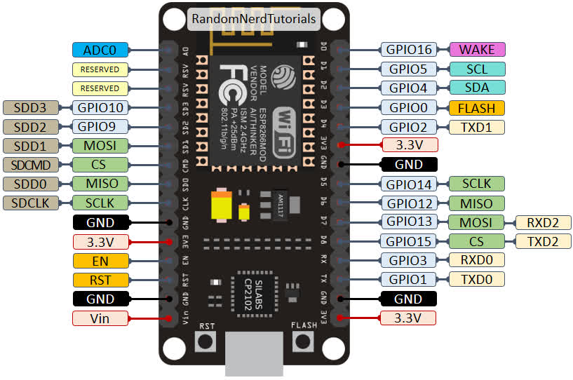
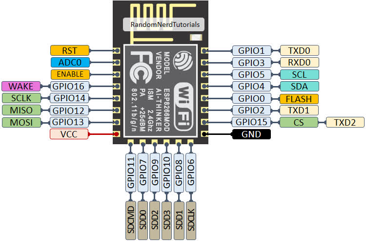

# NodeMCU ESP8266

## Specifications
TODO

## Pinout
### ESP8266 Peripherals
- 17 GPIOs
- SPI
- I2C (implemented on software)
- I2S interfaces with DMA
- UART
- 10-bit ADC

 

Label | GPIO | Input | Output | Notes
-|-|-|-|-
D0 | GPIO16 | no interrupt | no PWM or I2C support | HIGH at boot used to wake up from deep sleep
D1 | GPIO5 | OK | OK | often used as SCL (I2C)
D2 | GPIO4 | OK | OK | often used as SDA (I2C)
D3 | GPIO0 | pulled up | OK | connected to FLASH button, boot fails if pulled LOW
D4 | GPIO2 | pulled up | OK | HIGH at boot connected to on-board LED, boot fails if pulled LOW
D5 | GPIO14 | OK | OK | SPI (SCLK)
D6 | GPIO12 | OK | OK | SPI (MISO)
D7 | GPIO13 | OK | OK | SPI (MOSI)
D8 | GPIO15 | pulled to GND | OK | SPI (CS); Boot fails if pulled HIGH
RX | GPIO3 | OK | RX pin | HIGH at boot
TX | GPIO1 | TX pin | OK | HIGH at boot; Debug output at boot, boot fails if pulled LOW
A0 | ADC0 | Analog Input | X |

## Documents and References
- [NodeMCU documenation](https://nodemcu.readthedocs.io/)
- [NodeMCU firmware](https://github.com/nodemcu/nodemcu-firmware)
- [NodeMCU datasheet](https://components101.com/development-boards/nodemcu-esp8266-pinout-features-and-datasheet)
- [ESP8266 Pinout Reference: Which GPIO pins should you use?](https://randomnerdtutorials.com/esp8266-pinout-reference-gpios/)

## Tutorials
- [Installing ESP8266 NodeMCU Board in Arduino IDE 2.0 (Windows, Mac OS X, Linux)](https://randomnerdtutorials.com/installing-esp8266-nodemcu-arduino-ide-2-0/)
- [Getting Started with ESP8266 NodeMCU Development Board](https://randomnerdtutorials.com/getting-started-with-esp8266-wifi-transceiver-review/)