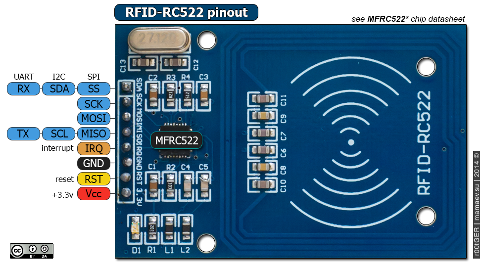

# RC522 RFID Reader Module

## Specification
> [Datasheet](./MFRC522.PDF)

Name|Value
-|-
Carrier Frequency | 13.56 MHz
Voltage Rate | 3.3 V
Current Rate (Normal mode) | 13 - 26 mA
Current Rate (Wait mode) | 10 - 13 mA
Current Rate (Sleep mode) | < 80 mA
Working Distance | 0 - 60 mm
Communication Protocol | SPI, SDA, 
Data Rate | 10 MBit/s
Size | 60 x 40 (mm2)

## Pinout diagram



Pin | Description
-|-
3.3V | Power VCC pin.
RST | Reset pin for the module.
GND | Power Ground Pin.
IRQ | Interupt pin, wake to module up when it goes into sleep mode to save power.
MISO | Master Input Slave Output. This pin connects with the Arduino/Microcontrollers for SPI communication. However, it transfers the data from module to Arduino. The MISO pin is also useable for other functions instead of SPI. It can also interface with I2C for clock pulse and UART Serial for Data transfer from the module.
MOSI | Master Output Slave Input. MOSI is the data input pin for RFID module in SPI communication
SCK | Clock Signal Pin.
SDA | Data Signal Pin.

## Setup
1. Download the [Library](https://github.com/miguelbalboa/rfid) 
```bash
arduino-cli lib install MFRC522
# or
arduino-cli lib install --git-url https://github.com/miguelbalboa/rfid
```

## References
1. [MFRC522 RFID Reader Interfaced With NodeMCU](https://www.instructables.com/MFRC522-RFID-Reader-Interfaced-With-NodeMCU/)
2. [Using an RFID module with an ESP8266](https://www.aranacorp.com/en/using-an-rfid-module-with-an-esp8266/)
3. [RFID RC522 Interfacing with NodeMCU](https://www.electronicwings.com/nodemcu/rfid-rc522-interfacing-with-nodemcu)
4. [RC522 RFID Reader Module with Arduino](https://microcontrollerslab.com/rc522-rfid-module-arduino-tutorial/)
5. [RFID CARD READER WITH ARDUINO,RFID-RC522 and LCD 16x2](https://www.instructables.com/RFID-CARD-READER-WITH-ARDUINORFID-RC522-and-LCD-16/)
6. [How to Use the RFID-RC522 Module With Arduino](https://www.instructables.com/How-to-Use-the-RFID-RC522-Module-With-Arduino/)
7. [Yet Another Instructable on Using the DIYMall RFID-RC522 and Nokia LCD5110 With an Arduino](https://www.instructables.com/Yet-Another-Instructable-on-Using-the-DIYMall-RFID/)