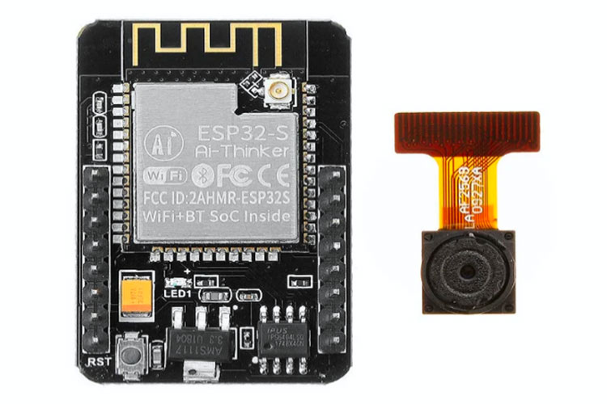
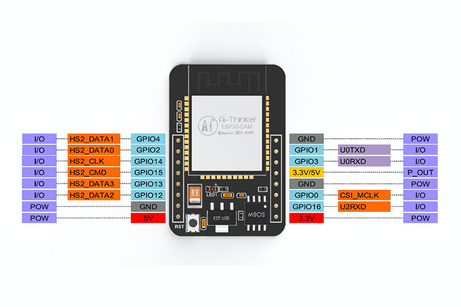

# Module ESP32-CAM + OV2640

The ESP32-CAM is a small-size, low-power camera module based on ESP32. It comes with an OV2640 camera and provides an onboard TF card slot. This board has 4MB PSRAM which is used for buffering images from the camera into video streaming or other tasks and allows you to use higher quality in your pictures without crashing the ESP32. It also comes with an onboard LED for flash and several GPIOs to connect peripherals.

## Specification
> [Datasheet](./ESP32-CAM_datasheet.pdf)

Name | Value
-|-
Package | DIP 16
Dimensions | 27 x 40,5 x 4,5 (mm x mm x mm)
RAM | 520KB Internal + 2M PSRAM External
Bluetooth Standard | Bluetooth 4.2BR / EDR and BLE
Wifi Standard | IEEE 802.11 b/g/n/e/i
Peripheral interface | UART, SPI, I2C, PWM
External memory | Maximum 4G
IO pins | 9
UART baudrate rate | default 115200 bps
Output image format | JPEG, BMP, GRAYSCALE
Operating frequency | 2412 ~ 2484 MHz
Antenna | Onboard PCB antenna
SPI Flash | 32Mbit
Security | WPA/WPA2/WPA2-Enterprise/WPS

- Transmitting power:
    - 802.11b: 17 ±2dBm(@11Mbps)
    - 802.11g: 14 ±2dBm(@54Mbps)
    - 802.11n: 13 ±2dBm(@HT20,MCS7)
- Reception sensitivity:
    - CCK,1Mbps: -90 dBm
    - CCK,11Mbps: -85 dBm
    - 6Mbps(1/2 BPSK): -88 dBm
    - 54Mbps(3/4 64-QAM): -70 dBm
    - HT20,MCS7(65Mbps, 72.2Mbps): -67 dBm
- Power consumption:
    - Flash off: 180mA@5V
    - Flash on and brightness max: 310mA@5V
    - Deep-Sleep: as low as 6mA@5V
    - Modern-Sleep: as low as 20mA@5V
    - Light-Sleep: as low as 6.7mA@5V

## Pinout Diagram

## Driver

## Documents and References
- https://components101.com/modules/esp32-cam-camera-module
- Dronebotworkshop's Tutorial [Article](https://dronebotworkshop.com/esp32-cam-intro/) | [Youtube](https://www.youtube.com/watch?v=visj0KE5VtY)
- How to setup and use ESP32 Cam with Micro USB WiFi Camera [Youtube](https://www.youtube.com/watch?v=RCtVxZnjPmY)