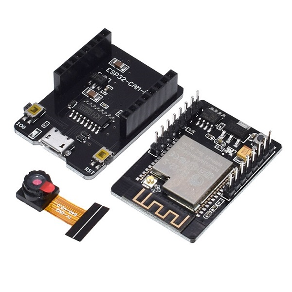

# Module ESP32-CAM + OV2640 + ESP32-CAM-MB USB Programmer

<!-- |    ESP32-CAM + OV2640 + ESP32-CAM-MB     |         ESP32-CAM + OV2640         |
| :--------------------------------------: | :--------------------------------: |
|  |  | -->

 

The ESP32-CAM is a small-size, low-power camera module based on ESP32. It comes with an OV2640 camera and provides an onboard TF card slot. This board has 4MB PSRAM which is used for buffering images from the camera into video streaming or other tasks and allows you to use higher quality in your pictures without crashing the ESP32. It also comes with an onboard LED for flash and several GPIOs to connect peripherals.

## Specification
> [Datasheet](./ESP32-CAM_datasheet.pdf)

Name | Value
-|-
Package | DIP 16
Dimensions | 27 x 40,5 x 4,5 (mm x mm x mm)
RAM | 520KB Internal + 2M PSRAM External
Bluetooth Standard | Bluetooth 4.2BR / EDR and BLE
Wifi Standard | IEEE 802.11 b/g/n/e/i
Peripheral interface | UART, SPI, I2C, PWM
External memory | Maximum 4G
IO pins | 9
UART baudrate rate | default 115200 bps
Output image format | JPEG, BMP, GRAYSCALE
Operating frequency | 2412 ~ 2484 MHz
Antenna | Onboard PCB antenna
SPI Flash | 32Mbit
Security | WPA/WPA2/WPA2-Enterprise/WPS
Transmitting power | 802.11b: 17 ±2dBm(@11Mbps) 802.11g: 14 ±2dBm(@54Mbps) 802.11n: 13 ±2dBm(@HT20,MCS7)
Reception sensitivity | CCK,1Mbps: -90 dBm  CCK,11Mbps: -85 dBm 6Mbps(1/2 BPSK): -88 dBm 54Mbps(3/4 64-QAM): -70 dBm HT20,MCS7(65Mbps, 72.2Mbps): -67 dBm
Power consumption |  Flash off: 180mA@5V  Flash on and brightness max: 310mA@5V  Deep-Sleep: > 6mA@5V  Modern-Sleep: > 20mA@5V  Light-Sleep: > 6.7mA@5V

## Pinout Diagram

## Driver and Framework

https://github.com/espressif/esp32-camera
https://github.com/yoursunny/esp32cam
https://github.com/easytarget/esp32-cam-webserver
https://github.com/RuiSantosdotme/ESP32-CAM-Arduino-IDE
https://github.com/espressif/esp-idf

## Programmer
There're several ways to upload the code to the ESP32-CAM board : 
- Using an FTDI programmer
- Using ESP32-CAM-MB USB Programmer (The easier one and the one we use)

### FTDI programmer
ESP32-CAM|FTDI Programmer
-|-
GND|GND
5V|VCC (5V)
U0R|TX
U0T|RX
GPIO 0|GND

**Important**: GPIO 0 needs to be connected to able to upload code.

### ESP32-CAM-MB USB Programmer

## Documents and References
- ESP32 datasheet [Downloaded](./Docs/esp32_datasheet_en.pdf)
- ESP32-CAM datasheet [Downloaded](./ESP32-CAM_datasheet.pdf) | [Source](https://components101.com/modules/esp32-cam-camera-module)
- [ESP32 Arduino Core’s documentation](https://docs.espressif.com/projects/arduino-esp32)
- [ESP8266 Forum](https://www.esp8266.com/)
- [ESP-IDF Documentations](https://docs.espressif.com/projects/esp-idf/en/latest/esp32/get-started/index.html)

## Tutorials
- Dronebotworkshop's Tutorial [Article](https://dronebotworkshop.com/esp32-cam-intro/) | [Youtube](https://www.youtube.com/watch?v=visj0KE5VtY)
- How to setup and use ESP32 Cam with Micro USB WiFi Camera [Youtube](https://www.youtube.com/watch?v=RCtVxZnjPmY)
- RandomNerd's Tutorial [Artical](https://randomnerdtutorials.com/esp32-cam-video-streaming-web-server-camera-home-assistant/) | [Youtube](https://www.youtube.com/watch?v=36p9To2hfak)
- ESP32-Cam Complete Guide [Youtube](https://www.youtube.com/watch?v=hSr557hppwY)
- ESP32-CAM - Guide to making YOUR first DIY Security Camera [Youtube](https://www.youtube.com/watch?v=k_PJLkfqDuI&t=473s)
- ESP32-Cam Quickstart with Arduino Code [Youtube](https://www.youtube.com/watch?v=Sb08leLWOgA)
- Cheap Wi-Fi IP Surveillance Camera (Very little DIY needed) [Youtube](https://www.youtube.com/watch?v=MKiITEsOwRA)